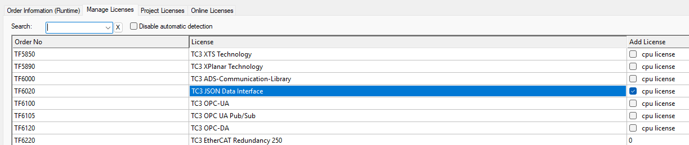

# TF6020 Json Data Interface on the CX8290

## Disclaimer

This guide is a personal project and not a peer-reviewed publication or sponsored document. It is provided “as is,” without any warranties—express or implied—including, but not limited to, accuracy, completeness, reliability, or suitability for any purpose. The author(s) shall not be held liable for any errors, omissions, delays, or damages arising from the use or display of this information.

All opinions expressed are solely those of the author(s) and do not necessarily represent those of any organization, employer, or other entity. Any assumptions or conclusions presented are subject to revision or rethinking at any time.

Use of this information, code, or scripts provided is at your own risk. Readers are encouraged to independently verify facts. This content does not constitute professional advice, and no client or advisory relationship is formed through its use.

## Description

This is a simple "how to" guide for setting up a local MQTT broker, and testing the local TF6020 Json Data Interface. This example can then be expanded to remote brokers and remote clients.

> [!CAUTION]
> This example will configure an unsecure connection. For production, you must configure authentication and encryption in your broker!

## SSH

We will be connecting to the CX8290 using SSH. This allows us to use our Windows CMD window to issue commands directly to the Linux os.

```
ssh Administrator@<ip-address>
```

To connect, you will need to type in your password.

## 1. Install a local MQTT broker (mosquitto) and utilities on CX8290

First we will install a location MQTT Broker and allow local incoming connections on port 1883.

1. Install mosquitto

   ```bash
   sudo apt-get update
   sudo apt-get install mosquitto mosquitto-clients
   ```

2. Create the mosquitto configuration

   ```
   sudo mkdir -p /etc/mosquitto/conf.d
   sudo nano /etc/mosquitto/conf.d/010-json-interface.conf
   ```

3. Edit the file

   Add the following content after any remote connections.

   ```bash
   listener 1883 127.0.0.1
   allow_anonymous true
   connection_messages true
   ```

   Press `ctrl + o` then `enter` to save. Then `ctrl + x` to exit.

4. Restart Mosquitto

   ```bash
   sudo service mosquitto restart
   ```

## 2. Configure TF6020 on the CX8290 to use the local MQTT broker

1. Install TF6020

   Good news, TF6020 is already included with TwinCAT XAR. We only need to configure and license it for it to become active.

2. Configure TF6020 by editing StaticRoutes.xml

   As our MQTT Broker is local our address will be 127.0.0.1. We also need a topic to identify our controller, so for this example we will use "cx8290". This Topic should be unique for each controller connected in this way.

   ```bash
   sudo nano /etc/TwinCAT/3.1/Target/StaticRoutes.xml
   ```

   Add the following content after any remote connections. Remember, the topic is set to the topic we decided for the example. You can pick your own topic.

   ```xml
   <?xml version="1.0" encoding="UTF-8"?>
   <TcConfig xmlns:xsi="http://www.w3.org/2001/XMLSchema-instance">
       <RemoteConnections>

           <!-- other remote connections may be already be here -->

           <!-- start of section to add -->
           <Json>
               <Name>MyExampleConnection</Name>
               <Address>127.0.0.1</Address>
               <Topic>cx8290</Topic>
           </Json>
           <!-- end of section to add  -->

       </RemoteConnections>
   </TcConfig>
   ```

   Press `ctrl + o` then `enter` to save. Then `ctrl + x` to exit.

## 3. Setup the TwinCAT project on the Engineering PC

1. Ensure you have enabled the TF6020 and TC1200 Trial License



2. Create a basic TwinCAT PLC Project

We will read from an INT stored in Main. This INT shall be called nCounter and will have the value of 123.

```
PROGRAM Main
VAR
  nCounter : INT := 123;
END_VAR
```

3. Activate and run your TwinCAT project.

## 4. Test the setup on the CX8290

That's it, we are ready to test.

You will need to open two SSH windows for this. Just open two CMDs in Windows and make the SSH connection twice.

### Terminal 1: Subscriber

```bash
# -v: verbose, -t "#": subscribe to all topics
mosquitto_sub -v -t "#"
```

### Terminal 2: Publisher

Send a request to TwinCAT.

- Topic Structure: topic/req/\<AmsPort\>/\<InvokeId\>
  - topic: Defined in your XML above.
  - req: Indicates a request.
  - 851: Default AmsPort for the first PLC runtime.
  - 1: An arbitrary ID for this request.

```Bash
mosquitto_pub -t 'cx8290/req/851/1' -m '{"symbol":"MAIN.nCounter"}'
```

#### Expected Output

In Terminal 1, you should see:

1. The request you sent.
2. The response from TwinCAT (containing the value of MAIN.nCounter or an error code if the symbol doesn't exist).

```
cx8290/req/851/1 {"symbol":"MAIN.nCounter"}
cx8290/res/851/1 {"symbol":"MAIN.nCounter", "value": 123}
```
